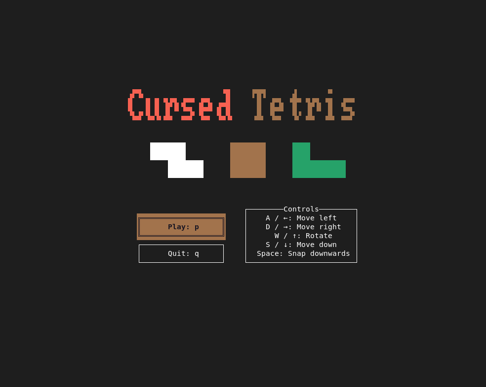
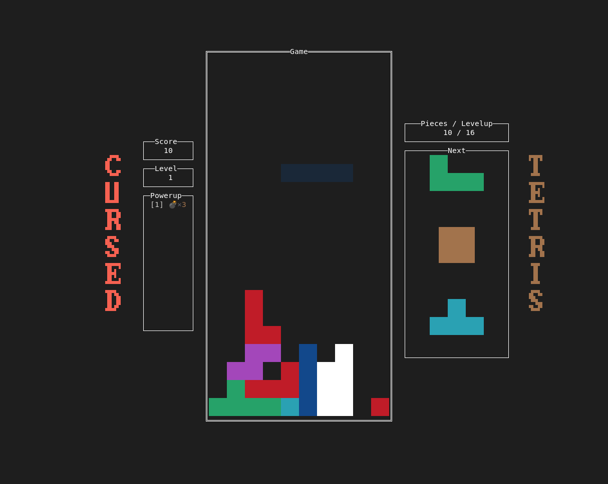

# Cursed Tetris

A terminal tetris game made using Ratatui and Crossterm in Rust, with some powerups for extra variety.

The implementation is pretty barebones, and mostly just an experience for me to learn Rust.

It is recommended to use a [Nerd Font](https://www.nerdfonts.com/) so that all text renders correctly.

|  |  |
| -------------------------- | ------------------------- |

## Play online!

1. Generate an SSH key if you don't have one already, using `ssh-keygen`
2. `ssh play@cursedtetris.orangishcat.dev`; your SSH key is your identity.

Server may or may not be online, or full, or whatever. No guarantees; I'm not very good with server infrastructure. You can always play offline.

**Note: Maximize your terminal when running the program!**

## Download instructions (for playing offline)

**Linux/MacOS**

**For MacOS, only Apple Silicon is supported as of right now**

1. Download the Linux or MacOS build of the [latest release](https://github.com/orangishcat/cursed-tetris/releases/latest)
2. Extract the tarball.
3. Open the terminal and change directory into the extracted directory using `cd`.
4. Run `./cursed-tetris` from the command line.

- (On MacOS, you may need to unquarantine and/or self-sign the binary first.)

**Windows**

1. Download the Windows exe of the [latest release](https://github.com/orangishcat/cursed-tetris/releases/latest).
2. Extract the zip and navigate into the extracted folder.
3. Double click the `.exe`/application.

## Self-hosting the online leaderboard

Run the game with a shared SQLite database and a stable player ID to enable the online
leaderboard:

```sh
cursed-tetris --online /var/lib/cursed-tetris/scores.sqlite3 --id PLAYER_ID
```

Both options are required together. For SSH hosting, the forced-command launcher should derive
`PLAYER_ID` from the authenticated public key. The ID is private to the database; players choose
a display name when they first submit a qualifying score.
